  
Updated: February 10, 2017

## Introduction

This is the first of several labs that are part of the **Oracle Public Cloud Integration Automation Workshop.** This workshop will showcase different technologies being deployed in an automated fashion.

**_To log issues_**, click here to go to the [github oracle](https://github.com/oracle/learning-library/issues/new) repository issue submission form.

## Objectives
- Git Clone the workshop
- Install Terraform
    - Install the OCI Terraform provider
- Download necessary WebLogic files
    - Move the files to the correct directory
- Modify the environment script to point to your environment
- Run Terraform 
    - `terraform plan -out=plan.out` to view what needs to be done 
    - `terraform apply plan.out` to apply those changes to the environment

## Required Artifacts
- The following lab requires an Oracle Public Cloud account that will be supplied by your instructor.
    - VirtualBox SOA VM 
    - The Server JRE (which includes necessary JDK bits for backend Java based solutions)
        - http://www.oracle.com/technetwork/java/javase/downloads/server-jre8-downloads-2133154.html
    - WebLogic Server Generic Installer 12.2.1
        - http://www.oracle.com/technetwork/middleware/weblogic/downloads/wls-for-dev-1703574.html
    - WebLogic Server Quick Installer 12.2.1
        - http://www.oracle.com/technetwork/middleware/weblogic/downloads/wls-for-dev-1703574.html

### **STEP 1**: Login to your Oracle Cloud VirtualBox VM
- If not done before, download VirtualBox from https://www.virtualbox.org/wiki/Downloads
    - Select the one that mataches your machine

    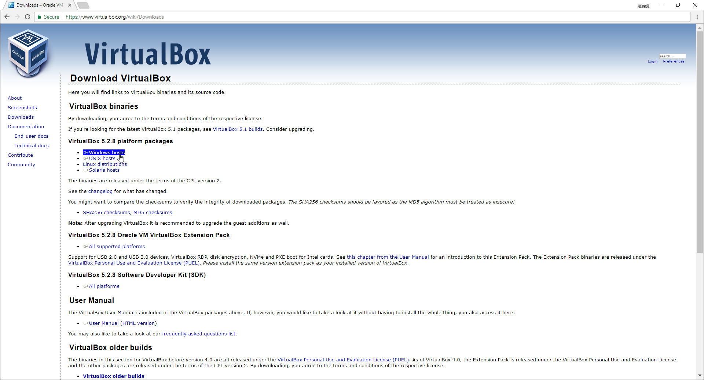

- After the download finishes launch the installer. 
    - Click through to install. 

    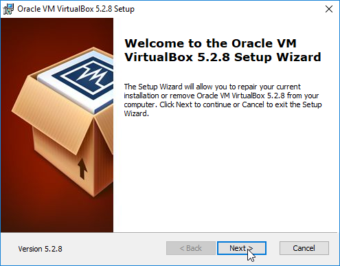

- Once VirtualBox is installed, open the application. 

    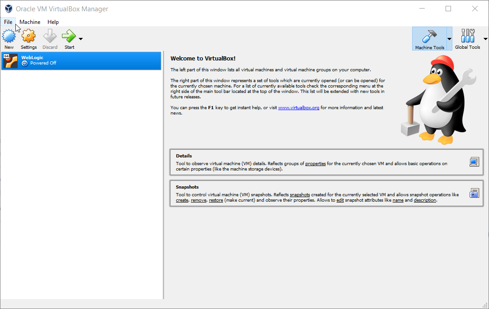

- **IMPORTANT** - Next steps expect you to have an ova file to import into VirtualBox. If you don't have the Virtual Machine image please contact your instructor. 

    

- Import your VM.
    - Click *File*
    - Click on *Import Appliance*

- You should get to this screen 

     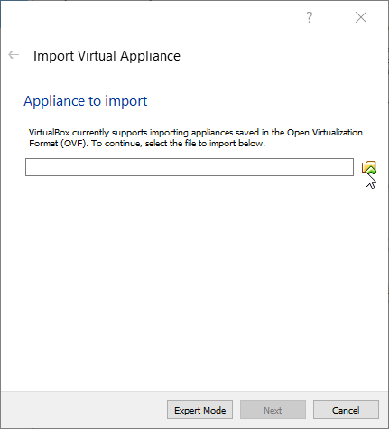

- Click on the folder icon.
    - Navigate to where you have the ova file. 
    - Click Next
    - Click Import 

    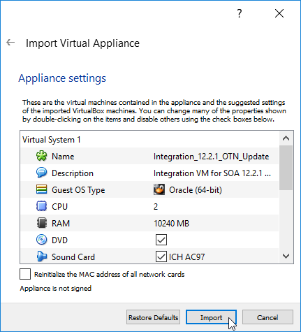

- You should now have an imported VM

    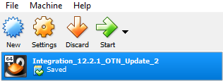

- Click Start 

### **STEP 2**: Git Clone the Workshop

- **IMPORTANT** - git should already be installed by default if not, simply run `yum install git` to install it on your VM 

    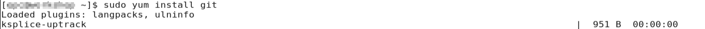

- Clone the workshop.

    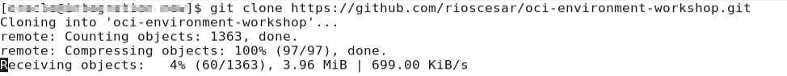

### **STEP 3**: Install Terraform and the OCI Provider 

- **IMPORTANT** - The following steps have been done through script to be portable. Commands should work on most *nix systems. There are other ways to install Terraform on Oracle UEL without the need for a script found here: https://community.oracle.com/docs/DOC-1019936 (Use at own discretion as this lab does not use steps on link)

- Change directory to environment-oci-automation. Here you will find many files which will be used later. Notice install.sh. We will run this file to install Terraform and the OCI Provider. 

    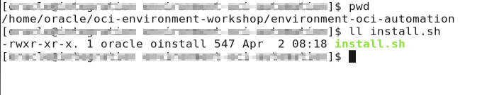

- Run the script.

    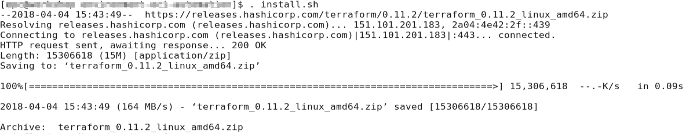

- Confirm Terraform installed correctly. 
    - Change directory back into environment-oci-automation
    - Run the command `terraform init`

    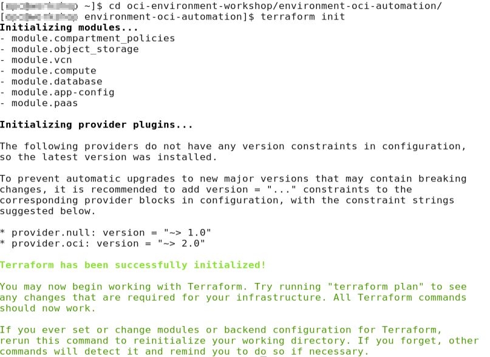

### **STEP 4**: Download the necessary files from Oracle

- Navigate to http://www.oracle.com/technetwork/middleware/weblogic/downloads/wls-for-dev-1703574.html.
    - Accept Licence Agreement
    - Download `Generic Installer for Oracle WebLogic Server and Oracle Coherence`
    - Download `Quick Installer intended for Oracle WebLogic Server and Oracle Coherence development only`

    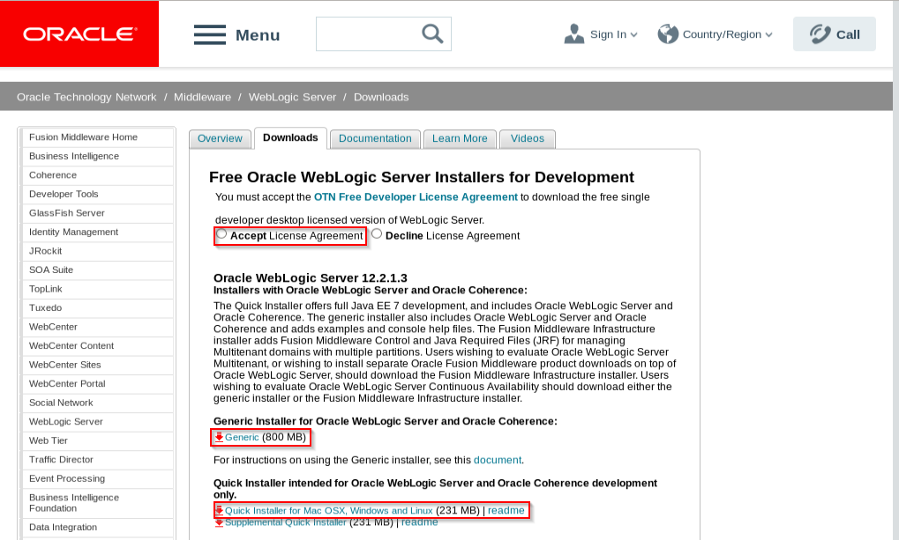

- Navigate to http://www.oracle.com/technetwork/java/javase/downloads/server-jre8-downloads-2133154.html.
    - Accept the Licence Agreement
    - Download `Server JRE (Java SE Runtime Environment) 8u161`

    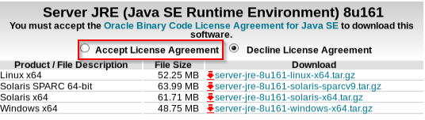

- Move files to their correct place.
    - Move both Weblogic files, `Generic Installer` and `Quick Installer`, to `installer/OracleWebLogic/dockerfiles/12.2.1`

    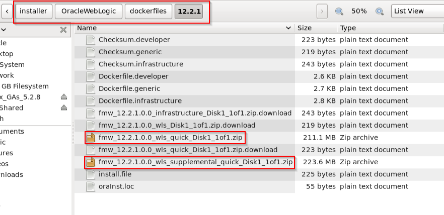

    - Move the `JRE Server` `to installer/OracleJava/java-8`

    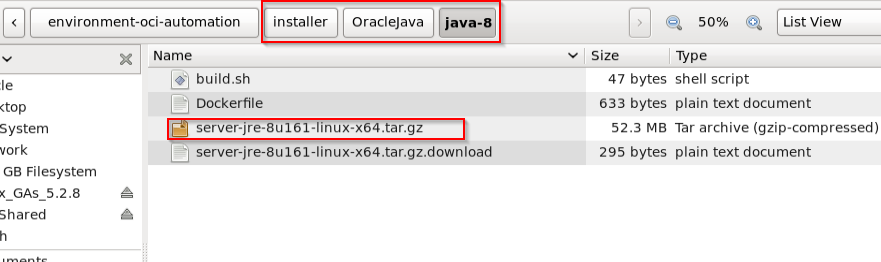

### **STEP 5**: Modify the env.sh file to point to your tenancy. 

- The env.sh file is found in the root of the project `environment-oci-automation/env.sh`

- Open up the file with your favorite editor. Here we are using `gedit`
    - Run `gedit env.sh`
    - Change:
        - tenancy_ocid
        - user_ocid
        - fingerprint
        - region
        - user
        - password
        - domain
        - tenancy
        - object_storage_user

    

    - Add `userdata` directory

    

- **IMPORTANT** - Instructor should have provided you with all the necessary information. If you are missing anything contact your instructor. 

- Set your environment.
    - `. env.sh`

### **STEP 6**: Plan your deployment

- Run `terraform plan -out=plan.out`. This will show you what is going to be built. 

  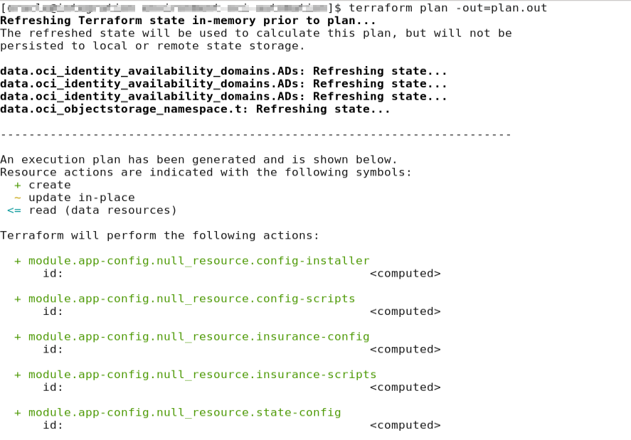

### **STEP 7**: Start the deployment

- Run `terraform apply plan.out` to apply the instructions previously outputted. 

    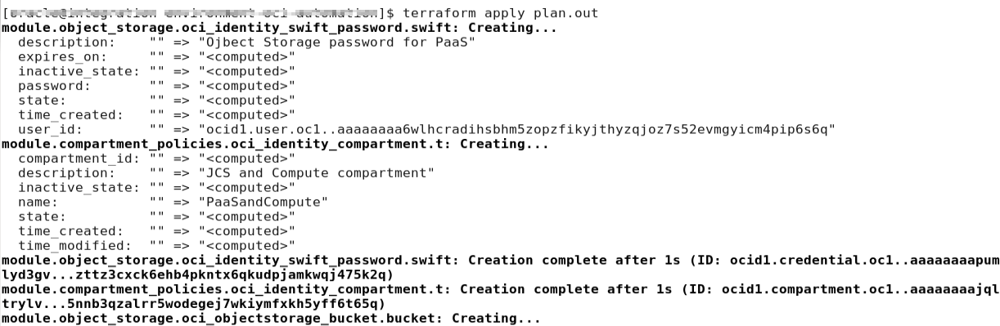