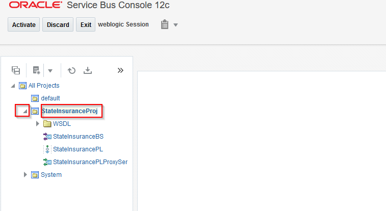

  
Updated: 04/02/2018

## Introduction

 This lab tutorial shows you how to deploy an Oracle Service Bus application to Oracle SOA Suite Cloud Service.

**_To log issues_**, click here to go to the [github oracle](https://github.com/oracle/learning-library/issues/new) repository issue submission form.

## Objectives

- Using this lab, you can deploy your Oracle Service Bus applications to Oracle SOA Suite Cloud Service. Because this cloud service uses the same Oracle SOA Suite software that you use for your on-premises applications, you can use the same tools in the cloud.

## Required Artifacts

- SOACS instance must be up and running before running the lab.

# Deploying an Oracle Service Bus Application to Oracle SOA Suite Cloud Service

## Service bus console application

### **STEP 1**: Login to your Oracle cloud account using **username** and **password**

- Login to your Oracle cloud account using **username** and **password** given by the instructor.

	 

- On the dashboard you can see a SOA instance running. Click on it.

	 	

- On the next page, click on "Open Service Console".
	
	

- Now, you can see a SOACS instance. From the "hamburger" menu on right, click on "Open Service Bus Console".

		

- Login to service bus console using the **username** and **password**.

	 

- This will open the service bus console.

	 	

- Click on "Create" on the left hand side.
	
	

- Now, click on "import config jar" as shown below.

	

- It should open a new window to import the jar file. Click on Browse.

	

- Browse the zar file and open it.

	

- Click on next arrow mark.

	

- Accept the default values and Click on "Import".

	

- A success message would be popped if the import is successful. Hit Close.

		

- On the left hand panel, you will see your project that was imported. Expand it by clicking on the expanstion button.
	
	

- Click on the business service for the project as shown below in the screenshot.

	

- This opens up the business process definition. On the left hand side click on "Transport".
	
	

- The endpoint URL's need to be modified so that it points the application being deployed on Cloud. If the endpoint is pointing to localhost replace with actual ip of the app on cloud.

	 

- The actual url should something like this.

	 

- Click on "Activate".

	

- Confirm the session activation. This should activate the service.

	
			
- You can test the service by clicking on green button for test console on the right hand side.

	

- This opens up a new window for testing. Choose the method you want to test. From the dropdown shown below choose the method to test.

	

- Click on "execute" to invoke the service and see test results.

	

- In the response document, you should be able to see the response returned by your service.

	

- This completes the manual SOA deployment section for this part of the Lab.

		

